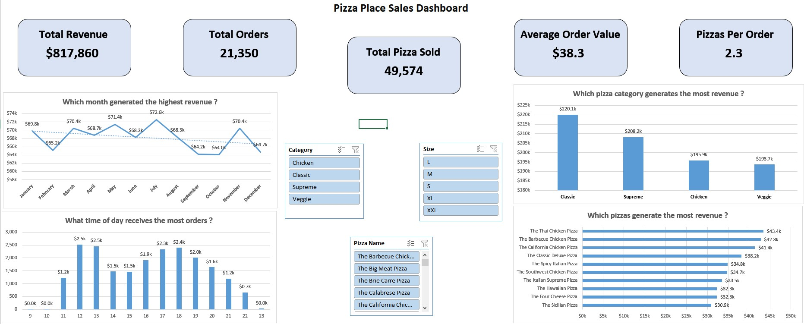
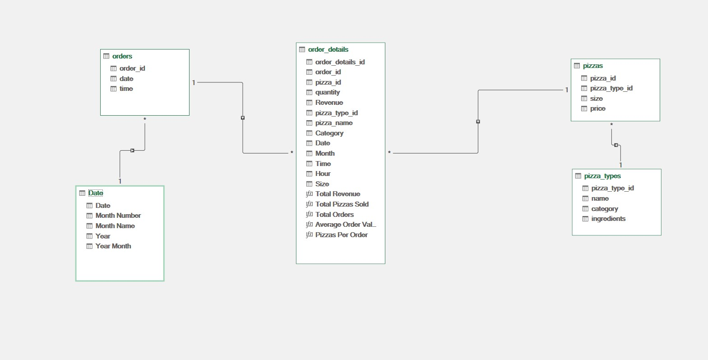

# 🍕 Pizza Place Sales Analysis — Excel Project

An end-to-end sales analysis of a full year of pizza orders (2015), built entirely in **Excel** using **Power Query**, **Power Pivot / DAX**, dynamic array formulas, and an interactive one-page **dashboard**.



---

## 📌 Project Overview

A pizza place needs to understand its own sales data: which months perform best, when orders peak during the day, which pizza categories and sizes drive revenue, and which specific pizzas are the top sellers. This project takes four raw, relational CSV files and turns them into a clean, connected data model with a single interactive dashboard that answers those questions at a glance.

**Key numbers for the year:**

| Metric | Value |
|---|---|
| Total Revenue | **$817,860** |
| Total Orders | **21,350** |
| Total Pizzas Sold | **49,574** |
| Average Order Value | **$38.30** |
| Pizzas per Order | **2.32** |

---

## 🗂️ The Dataset

The raw data comes as **4 relational CSV files** (included in this repo under `/data/raw`):

| File | Rows | Description |
|---|---|---|
| `orders.csv` | 21,351 | One row per order: `order_id`, `date`, `time` |
| `order_details.csv` | 48,621 | One row per pizza sold within an order: `order_details_id`, `order_id`, `pizza_id`, `quantity` |
| `pizzas.csv` | 97 | Each pizza SKU: `pizza_id`, `pizza_type_id`, `size`, `price` |
| `pizza_types.csv` | 32 | Pizza catalog: `pizza_type_id`, `name`, `category`, `ingredients` |

These four tables are relational — `order_details` is the fact table that connects to `orders` (by `order_id`) and to `pizzas` (by `pizza_id`), which in turn connects to `pizza_types` (by `pizza_type_id`). A custom `Date` table was also built to support clean time-intelligence analysis.



---

## 🛠️ Tools & Techniques Used

- **Excel Tables** — every sheet is a structured Table for dynamic, self-expanding ranges
- **Power Query** — importing and shaping the 4 CSVs into the workbook
- **Power Pivot / Data Model** — relationships between `orders`, `order_details`, `pizzas`, `pizza_types`, and `Date`
- **DAX Measures** — `DISTINCTCOUNT`, `SUM`, `DIVIDE`
- **Dynamic Array Formulas** — `XLOOKUP`, `SEQUENCE`, `TEXT`, `HOUR`
- **PivotTables & PivotCharts** — feeding the dashboard visuals
- **Slicers** — Category, Size, and Pizza Name, for interactive filtering
- **One-page Dashboard** — KPI cards + 4 charts answering 4 core business questions

---

## 🔄 Project Workflow

### 1. Import & clean with Power Query
The four CSVs (`orders`, `order_details`, `pizzas`, `pizza_types`) were imported through **Power Query**, where data types were fixed (dates as Date, time as Time, price as Decimal), column names standardized, and each query was loaded as a Table into its own worksheet.

### 2. Build a full Date dimension table
To avoid gaps in the time-based charts (days with zero orders would otherwise disappear from the axis), a complete calendar table was generated with a single dynamic array formula:

```excel
=SEQUENCE(MAX(orders[date])-MIN(orders[date])+1, , MIN(orders[date]), 1)
```

This creates one row for **every single day** between the first and last order date — with no missing days — which became the `Date` table and the base of the data model's time intelligence.

### 3. Enrich the fact table with XLOOKUP
Rather than relying only on relationships, the `order_details` table (the fact table) was enriched directly with helper columns using `XLOOKUP`, so it could be sliced and summarized on its own:

```excel
Revenue      = [@quantity] * XLOOKUP([@pizza_id], pizzas[pizza_id], pizzas[price])
pizza_type_id= XLOOKUP([@pizza_id], pizzas[pizza_id], pizzas[pizza_type_id])
pizza_name   = XLOOKUP([@pizza_type_id], pizza_types[pizza_type_id], pizza_types[name])
Category     = XLOOKUP([@pizza_type_id], pizza_types[pizza_type_id], pizza_types[category])
Date         = XLOOKUP([@order_id], orders[order_id], orders[date])
Month        = TEXT([@Date], "mmmm")
Time         = XLOOKUP([@order_id], orders[order_id], orders[time])
Hour         = HOUR([@Time])
Size         = XLOOKUP([@pizza_id], pizzas[pizza_id], pizzas[size])
```

This one enrichment step is what makes every pivot table and chart in the dashboard possible from a single table.

### 4. Build the data model in Power Pivot
`orders`, `order_details`, `pizzas`, `pizza_types`, and `Date` were added to the **Power Pivot Data Model** and connected in a star-schema layout (see diagram above), enabling clean, fast aggregation with DAX instead of heavy formulas across 48,000+ rows.

### 5. Write DAX measures
Key measures created in Power Pivot:

```dax
Total Revenue        = SUM(order_details[Revenue])
Total Orders          = DISTINCTCOUNT(orders[order_id])
Total Pizzas Sold     = SUM(order_details[quantity])
Average Order Value   = DIVIDE([Total Revenue], [Total Orders])
Pizzas Per Order       = DIVIDE([Total Pizzas Sold], [Total Orders])
```

### 6. PivotTables → PivotCharts → Dashboard
Six PivotTables (on the `Dashboard Pivots` sheet) feed four PivotCharts and five KPI cards, all assembled on a single `Dashboard` sheet with slicers for interactive filtering.

---

## 📊 The Dashboard — 4 Questions, Answered

| Question | Chart Type | Answer |
|---|---|---|
| Which month generated the highest revenue? | Line chart | **July** — $72,557.90 |
| What time of day receives the most orders? | Column chart | **12 PM (noon)** — 2,520 orders |
| Which pizza category generates the most revenue? | Column chart | **Classic** — $220,053.10 |
| Which pizzas generate the most revenue? | Bar chart (Top 10) | **The Thai Chicken Pizza** — $43,434.25 |

Additional insights surfaced through the pivot tables:
- **Size:** Large (`L`) pizzas are the biggest revenue driver — $375,319 from 18,956 pizzas sold, more than double the next closest size.
- **Seasonality:** Revenue is fairly stable month-to-month (~$64k–$72.6k), with a dip in Sept–Oct and a clear peak in July.
- **Order timing:** Orders are heavily concentrated in the **11 AM – 9 PM** window, with two clear peaks around lunch (12–1 PM) and dinner (5–6 PM); almost nothing before 11 AM or after 11 PM.

> The slicers (Category, Size, Pizza Name) let you filter every chart and KPI on the dashboard live — try isolating just the "Chicken" category or the "L" size to see how the story changes.

---

## 📁 Repository Structure

```
├── pizza_sales_finished.xlsx     # Final workbook — cleaned data, model, dashboard
├── README.md
├── dashboard_preview.png     # Dashboard screenshot
└── data_model.png            # Data model relationship diagram
```


---

## 🚀 How to Use

1. Download `pizza_sales_finished.xlsx`
2. Open it in **Excel (2021 / Microsoft 365 recommended**, for `XLOOKUP` and dynamic array support)
3. Go to the **Dashboard** sheet
4. Use the slicers at the top to filter by **Category**, **Size**, or **Pizza Name**
5. Explore the **Dashboard Pivots** sheet to see the PivotTables behind each chart, or open **Data → Manage Data Model** to inspect the Power Pivot relationships and DAX measures directly

---

## ✍️ Notes

- All calculations are formula/DAX-driven — no hardcoded values — so the workbook fully recalculates if the underlying CSVs are refreshed through Power Query.
- The `Date` table is intentionally generated with `SEQUENCE` rather than pulled from `orders[date]` directly, to guarantee a continuous calendar with no missing days for time-intelligence.

---

## 📬 Contact

Feel free to reach out or open an issue if you spot something to improve.

🔗 *www.linkedin.com/in/fares-shaaban-279134434*
💼 *https://www.fiverr.com/users/fares_shaaban*

